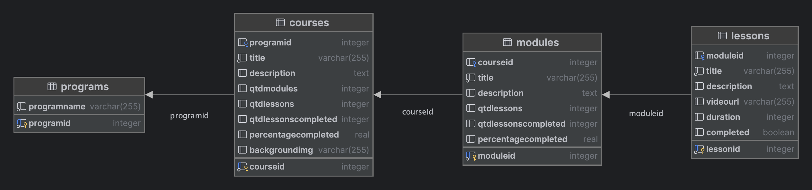
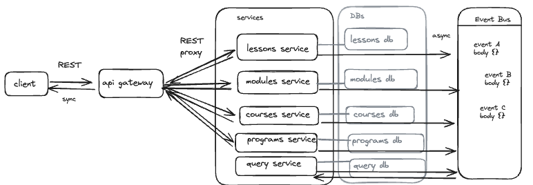

# Launchcate

This project is a full-stack application built with Next.js, NestJS, and Prisma.

## Clients
TBC: Mobile App built on React Native.

### Frontend

The frontend client is built using Next.js, a popular React framework for building user interfaces. Access it here [Frontend App](https://educate-z5y4.vercel.app/)

## API Gateway

The API Gateway is the entry point for clients to interact with the microservices. It handles client requests by routing them to the appropriate microservice. The API Gateway also aggregates the responses from the microservices and returns them to the client. This decouples the client from the microservices, allowing them to evolve independently. 

For more details, see the [API Gateway README](./backend/api-gateway/README.md).

## Microsservices
TBC: Two more microservices (programs and modules).

### Lessons

The `lessons` microservice is built using NestJS, a progressive Node.js framework for building efficient and scalable server-side applications. It is responsible for managing the lessons in the application. 

For more details, see the [lessons microservice README](./backend/services/lessons/README.md).

### Courses

The `courses` microservice, also built with NestJS, manages the courses in the application. 

For more details, see the [courses microservice README](backend/services/courses/README.md).

## Database

The database for the application is built using Prisma. Here's a diagram of the database structure:

## Architecture
The architecture of this application applies a microservices pattern. The client sends REST requests to an API Gateway, which connects to the microservices via a reversed proxy. 

To handle CQRS, a Query Service is used for communication between the microservices using an event bus. This allows the application to scale and handle high loads of operations.

Here's a simplified diagram of the architecture:

## Stay in touch

Author - [Felipe Silveira](https://github.com/sziafs)

## License

This is a [MIT licensed](LICENSE) open source project created to practice my skills. If you'd like to see the inspiration platform, please [access here](https://app.digital-launchpad.com).